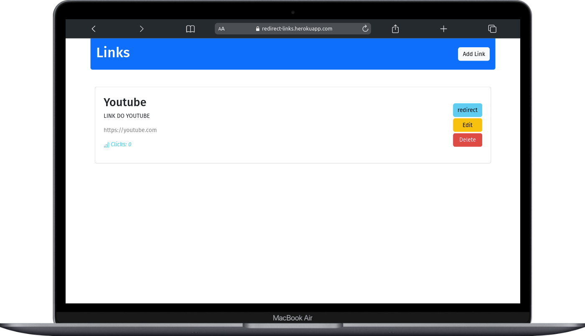
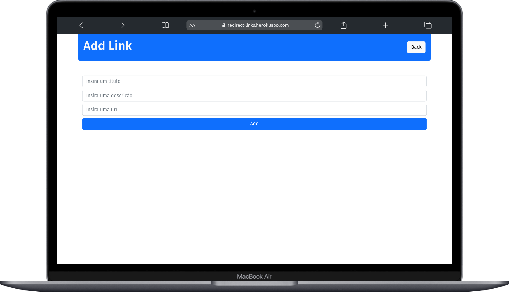
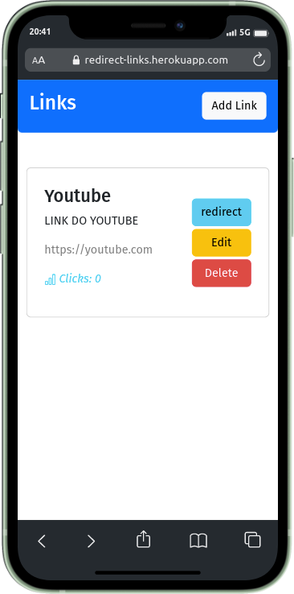
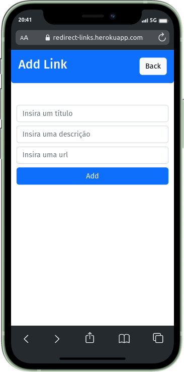

<h2 align="center">
   Tenha controle de seus links
</h2>
<h1 align="center">
     
</h1>

</p>

<h4 align="center">
	🚧 Concluído 🚀 🚧
</h4>

## 💻 Sobre o projeto

[Redirect-Links](https://redirect-links.herokuapp.com/) foi desenvolvido durante o curso do [Programador BR](https://programadorbr.com/), o objetio deste projeto é ter controle sobre os links, podendo visualizar o tanto de redirects (clicks) que cada link criado teve. Neste projeto também foi abordado alguns conceitos de CRUD, como poder criar um link (CREATE), poder visualizar o link (READ), editar um link (UPDATE) e deletar um link (DELETE).

---

## ⚙️ Funcionalidades

-   [x] Gerenciamentos de links

    -   [x] Pode adicionar um link
    -   [x] Poder remover um link
    -   [x] Poder editar o link
    -   [x] Poder redirecionar para a url do link
        -   Contar clicks

-   [x] Adaptação para diversos dispositivos
    -   [x] Desktop
    -   [x] Tablet
    -   [x] Mobile

---

## 🎨 Layout

### Desktop

<p align="center" style="display: flex; align-items: flex-start; justify-content: center;">
  
 
  
</p>

---

### Mobile

<p align="center" style="display: flex; align-items: flex-start; justify-content: center;">
  
 
  
</p>
---

## 🚀 Deploy

Para ver a aplicação em produção acesse [Deploy](https://redirect-links.herokuapp.com/)

### Pré-requisitos

Antes de começar, você vai precisar ter instalado em sua máquina as seguintes ferramentas:
[Git](https://git-scm.com), [Node.js](https://nodejs.org/en/) e o [MongoDB](https://mongodb.com/) .
Além disto é bom ter um editor para trabalhar com o código como [VSCode](https://code.visualstudio.com/)

#### 🎲 Rodando o Backend (servidor)

```bash

# Clone este repositório
$ git clone git@github.com:matdevz/REDIRECT-LINKS.git

# Acesse a pasta do projeto no terminal/cmd
$ cd redirect-links

# Instale as dependências
$ npm install

# Execute a aplicação
$ npm start || yarn start

# O servidor inciará na porta:3001 - acesse http://localhost:3001

```

---

## 🛠 Tecnologias

As seguintes ferramentas foram usadas na construção do projeto:

-   **[MongoDB](https://mongodb.com/)**
-   **[NodeJS](https://nodejs.org/)**
-   **[Mongoose](https://mongoose.com/)**
-   **[EJS](https://ejs.com/)**
-   **[Bootstrap](https://getbootstrap.com/)**
-   **[JavaScript](https://javascript.com)**

---

## 🦸 Autor

<a href="https://github.com/matdevz">
 
 <br />
 <sub><b>Mateus Henrique</b></sub></a> <a href="https://blog.rocketseat.com.br/author/thiago/" title="Rocketseat">🚀</a>
 <br />

[](https://twitter.com/matdevz)
[](https://www.linkedin.com/in/mateus-henrique-ab4374224/)
[](mailto:contatodevmateus@gmail.com)

---

## 📝 Licença

Este projeto esta sobe a licença MIT

Desenvolvido por Mateus Henrique 👋🏽 [Entre em contato!](https://www.linkedin.com/in/mateus-henrique-ab4374224/)
